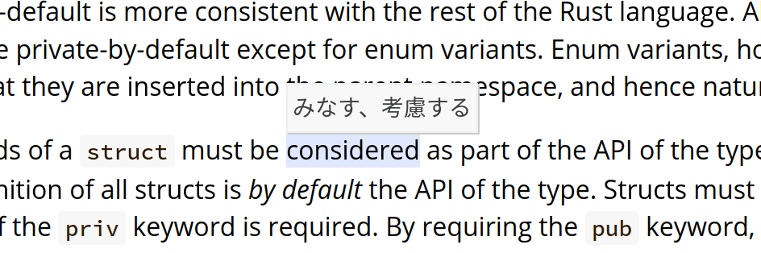

# 日本語辞書tooltipつきRust RFC生成
- Experimental
- 現在は仕組みができて辞書のデータをこれから充実させていこうという段階です。

# 内容
以下のように、単語にカーソルが来ると訳が浮かび上がります。



# 参考、ライセンスなど
submoduleとして存在している2つのリポジトリについては、それぞれのライセンスの指示に従ってください。
- [rust-lang/rfcs](https://github.com/rust-lang/rfcs) MIT, Apache version 2.0 のいずれかで提供されています
- [DQNEO/gospec-analyzer](https://github.com/DQNEO/gospec-analyzer)

また、gospec-analyzerを全面的に参考・使用しています。DQNEOさんありがとうございます。

## 手順
- 辞書において無視する単語や訳語などのデータは `data/` にはいっています。(現在は一時的にgospecのものを使用しています) これをgospec-analyzerで用いるため `gospec-analyzer/data/` を消去して、 `data/` を代わりに配置します。

```shell
rm -rf gospec-analyzer/data/
cp -r data gospec-analyzer/
```

- 次に、gospec-analyzerをビルドします。makeとgoが必要です。次に生成されたバイナリを移動させます。

```shell
cd gospec-analyzer
# バイナリ生成
make bin/s2t
make bin/tokenizer
make gospec
make bin/tsv2json

cd ../ # rust-rfc-with-ja-dict-script $
# 移動
cp gospec-analyzer/bin/* bin/
cp gospec-analyzer/gospec bin/
```

- Rust RFC bookを生成して持ってくる(bookは別リポジトリで配信しているためignore)

```shell
cd rfcs
./generate-book.sh # book/に生成物ができる
cd .. # rust-rfc-with-ja-dict-script $
cp -r rfcs/book book
```

- word2stem.js(語形の変化を吸収する単語対応表)と、頻度表などを作る
- (割と時間がかかります)

```shell
python3 generate-word2stemjs.py
```

- HTMLにtooltip用のコードを追加します

```shell
python3 inject-to-html.py 
```

- generate dic.ja.js

```shell
bin/tsv2json data/dic.ja.tsv > docs/dic.ja.json
echo 'var dic = ' > docs/dic.ja.js
cat docs/dic.ja.json >> docs/dic.ja.js
cp docs/dic.ja.js addon/
```

- cp addon

```shell
mkdir addon/word2stem
cp docs/word2stem-*-*-*.js addon/word2stem/
cp -r addon book/
```

### 補足
- `python3 dictionary.py` でdict.csvとhist.txtが生成されます。これらはそれぞれ、登場する全単語(ただし、`is` のように一般的なものや訳す必要のない技術用語を除く)、その単語の登場回数が記録されています。
- 今後 `dict.csv` を頻度の高い順に埋めていけば辞書付きRFCが充実していきますが、どのようにcsvに書き込む仕組みを整えたらよいかはまだ分かってないです。何かアドバイスありましたらお願いします。 [Twitter @kaito_tateyama](https://twitter.com/kaito_tateyama)
